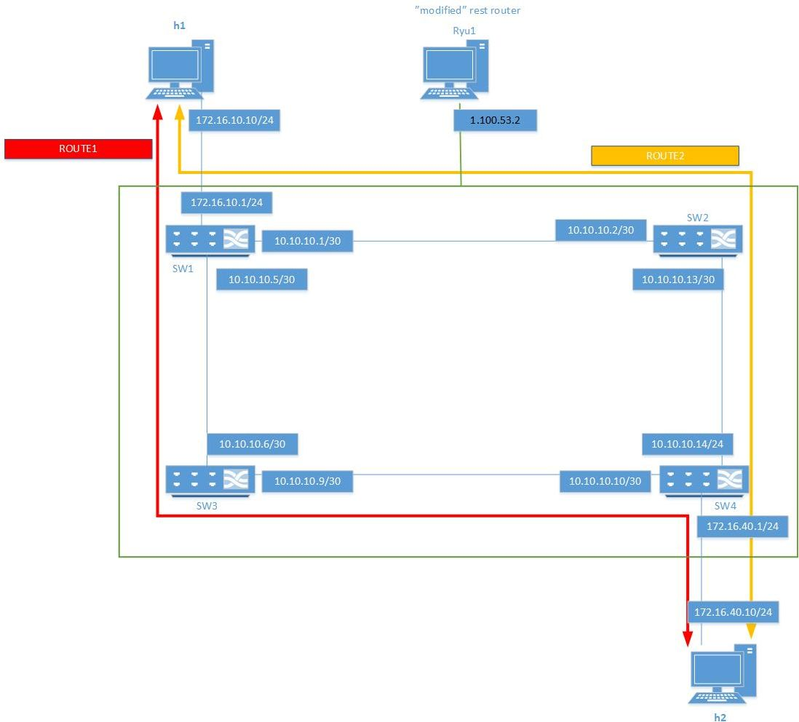

# Example of REST routing

The <a href="https://osrg.github.io/ryu-book/en/html/index.html">Ryu documentation</a> contains very good explanation of the existing Ryu rest routing application.
This is a example, how to create more advanced routing between networks with modified RYU rest router application.

## Background
While testing the existing rest routing application, it was very easy to mess up the routing totally.
As user can only enter routing data with multiple rest api calls (1 rest api call = 1 route modification), switching from one route to another isn't easy and at least it won't be fast when there is a network failure.

**_Note!_** While reading the existing documentation of the rest routing application, it was noticed that sometimes the given example was not working.
More detailed investigation showed that, if routes were written in wrong order, the defined route might not work.
It was noticed that static routing rules needs to be always pushed to switches before default routing rules.

## Problem Description
If topology is big and/or complicated, swiching from one routing to another should be fast and easy.

Following shows the example of the used topoplogy.  



## Network configuration
The example is the same than in the <a href="https://osrg.github.io/ryu-book/en/html/index.html">Ryu documentation</a>.
So the problem is : how to switch fast between defined routing configuration.


ROUTE 1 TABLE
Static routing

|SwitchID | Destination | Gateway |
|--- | --- | --- |
|0000000000000003 | 172.16.40.0/24 | 10.10.10.10 | 
|0000000000000003 | 172.16.10.0/24 | 10.10.10.5 |

Default Routing

|SwitchID | Default Gateway |
|--- | --- |
|0000000000000001 | 10.10.10.6 |
|0000000000000003 | 10.10.10.5 |
|0000000000000004 | 10.10.10.9 |


ROUTE 2 TABLE
Static routing

|SwitchID | Destination | Gateway |
|--- | --- | --- |
|0000000000000002 | 172.16.40.0/24 | 10.10.10.14 |
|0000000000000002 | 172.16.10.0/24 | 10.10.10.1 |

Default Routing

|SwitchID | Default Gateway|
|--- | --- |
|0000000000000001 | 10.10.10.2 |
|0000000000000002 | 10.10.10.1 |
|0000000000000004 | 10.10.10.13 |


## Solution
The given solution will add new REST methods to RestRouterAPI class:
    * rest method to add a new route to a routeset
    * rest method to enable/disable a routeset
    * rest method to read 1 or all routesets data
    * rest method to delete 1 or all routesets data
    

The routes are stored in the class RouterController, class variable
    ```
    _PATH_LIST={}
    ```
In this case _PATH_LIST will be a python dictionary and toporoute id will be the used as a key.
Each element is a table containing 1..n route definitions.


Adding a new routedata is easy solution. First it will be checked that the data contains needed attributes i.e toporoute, sw and gateway.

Then it needs to be checked if the _PATH_LIST already has a set of routes defined for given toporoute.
If there is a route set for given toporoute, the new data is appended to the route set.
If not, new routeset is created with given toporoute.
Note! routedata is a dictionary, but each element of it is a table.
```python
    def _set_routedata (self,route_id, req):
        msg=""
        try:             
            rest = json.loads(req.body) if req.body else {}
        except SyntaxError:		    
            msg="Invalid syntax when adding route new route data"            
            raise SyntaxError(msg)

        rest_param=rest
        
        if rest_param.has_key("sw"):
            swid=rest_param['sw']
        else: 
            msg="Invalid syntax: sw parameter is missing"
            raise SyntaxError(msg)            

        if rest_param.has_key("gateway"):
            gateway=rest_param['gateway']
        else:             
            msg="Invalid syntax: gateway parameter is missing"
            raise SyntaxError(msg)            

        if rest_param.has_key("destination"):
            destination=rest_param['destination']
        else: 
            destination=""
      

        if self._PATH_LIST.has_key(route_id):
            item=self._PATH_LIST[route_id]
            item.append(rest_param)
            msg="Updated RouteData item : "+route_id+"  length:"+str(len(self._PATH_LIST[route_id]))
        else:
            msg="New RouteData added item: "+route_id
            self._PATH_LIST[route_id]=[rest_param]
               
        return msg
```

Getting routedata is easy. Empty dictionary will be returned if there is no data with given toporoute id
```python
    def _get_routedata (self, route_id, rest_param):
        if route_id == REST_ALL:
            return self._PATH_LIST

        if self._PATH_LIST.has_key(route_id):
            return self._PATH_LIST[route_id]
        else:
            msg="No route found with given route id: "+route_id
            raise NotFoundError(msg)             
```

For deleting a routedata, the pop method of dictionary can be used.
```python
    def _del_routedata (self,route_id,rest_param):    
       if self._PATH_LIST.has_key(route_id):
           self._PATH_LIST.pop(route_id,None)
           msg="Route :" + route_id +" deleted \n"
           return msg
       else:
           msg="No route found with given route id: "+route_id
           raise NotFoundError(msg)
```

When activating the routedata, it will be checked if the route exists.
The route table will be looped and each routing data will be written to the switch.
When enabling a route, the existing set_data function of the Router class will be called with correct parameters.
Return value is a list of messages returned by the set_data.
```python
    def _activate_route_data(self, route_id, req):
        
        msgs = []

        try:             
            rest = json.loads(req.body) if req.body else {}
        except SyntaxError:
            mgs=string('Invalid syntax %s', req)
            raise SyntaxError(msg)

        rest_param=rest
                
        if not(self._PATH_LIST.has_key(route_id)):
            msg= "Error, route id: "+route_id+ " not found."
            raise NotFoundError(msg)
      
      
        # new route will be enabled only if it isn't the active one
        if int(route_id)!=self.current_active_route: 
            routes=self._PATH_LIST[route_id]          
            self.set_route_id(int(route_id))
        
            for item in routes:     
                if item.has_key("sw"):     
                    sw_id=item['sw']
                    gateway=item[REST_GATEWAY]                        
                    routedata={"sw_id":sw_id, "gateway":gateway}
            
                    if item.has_key(REST_DESTINATION):
                        destination=item[REST_DESTINATION]
                        routedata[REST_DESTINATION]=destination            

                    if item.has_key(REST_VLANID):       
                        vlanid=item[REST_VLANID]
                        routedata[REST_VLANID]=vlanid            

                    req2=json.dumps(routedata)                
                    print(req2)
                    
                    if item.has_key(REST_VLANID):
                        result=self._access_router(sw_id, vlanid,
                                       'set_data', req2)
                    else:                
                        result=self._access_router(sw_id, VLANID_NONE,
                                       'set_data', req2)        
                    
                    msgs.append(result)
                    
        return msgs
```

When disabling the active route data the existing delete_data function of the Router class will be called with correct parameters.
Return value is a list of messages returned by the delete_data.
```python
    def _disable_route_data(self, req):
        msgs = []
        msg="Active route with id: "+str(self.current_active_route) + " to be disabled"
        msgs.append(msg)

        if self.current_active_route>0 :
            
            routes=self._PATH_LIST[str(self.current_active_route)]
			
            for item in routes:

                sw_id=item['sw']
                routers = self._get_router(sw_id)

                for router in routers :
                    vlanid=-1
            
                    if item.has_key(REST_VLANID):
                        vlanid=item[REST_VLANID]
                        routerdata=self._access_router(sw_id, vlanid,
                                  'get_data', req.body)
                    else:
                        routerdata=self._access_router(sw_id, VLANID_NONE,
                                  'get_data',req.body)
            
                    if routerdata[0]["internal_network"][0].has_key("route"):
                        routerdataroute=routerdata[0]["internal_network"][0]["route"]
                        for route in routerdataroute:                    	                
                            if route.has_key("route_id"):
                                req2=json.dumps({"route_id":route["route_id"]})
                            else:
                                req2=json.dumps({})
                          
                            if vlanid>0:
                                result=self._access_router(sw_id, vlanid,
                                      'delete_data',req2 )
                            else:
                                result=self._access_router(sw_id, VLANID_NONE,
                                      'delete_data', req2)
                            msgs.append(result)
            self.set_route_id(0)			
        return msgs
```


## Lessons learned
When the network has a good amount of switches, routes, hosts and vlan's, defining the routes will take some time.

## Conclusion
The modifications were quite simple to make and with proposed solution it's quite easy to switch between different routing set.


## Further improvements
The code should be modified so that it can handle port state change events.


## Included files
For Ryu controller machine:
* rest_router2.py
    * this is the modified version of the existing rest_router.py
    * it needs to be installed to same directory than the original rest_router.py
    ```
    ryu-manager ryu.app.rest_router2.py
    ```
For mininet machine:
* problem3.py
    * this file contains code to create the mininet network
    * code will assign ip addresses and default gateways to hosts
    * code will also modify switches to listen OpenFlow 1.3 commands
    ```
    sudo python problem3.py
    ```
* addressing.py
    * assing needed addresses to switches and ports
    ```
    python addressing.py
    ```
* toporouting.py
    * creates needed routing tables to Ryu rest_router2.app
    ```
    python toporouting.py
    ```
* route1enable.py
    * removes any exsisting flow configuration from switches
    * activates the first route set
    ```
    python route1enable.py
    ```
* route2enable.py
    * removes any exsisting flow configuration from switches
    * activates the second route set
    ```
    python route2enable.py
    ```


## **REST API**
RYU uses Representational State Transfer (REST) API messages  to execute common operation. REST uses HTTP requests create, update, read, and delete data.


### 1 add a route to routeset

```
POST /routes/{route_id}
```

case1-1: set static route.
```
parameter = {"toporoute":"A","destination": "A.B.C.D/M", "gateway": "E.F.G.H","vlan_id":"A"}
```

case1-2: set default route.
```
parameter = {"toporoute":"A","gateway": "E.F.G.H","vlan_id":"A"}
```

* mandatory parameters
      *toporoute":"1", 
      *sw:"0000000000000003"
      *gateway":"10.10.10.5", 
*  optional parameters
      *destination":"172.16.10.0/24", 
      *vlan_id":"5"

Examples
```	  
curl -X POST -d '{"toporoute":"1", "sw":"0000000000000003", "destination":"172.16.10.0/24", "gateway":"10.10.10.5","vlan_id":"5"}'  http://1.100.53.2:8080/routes/1
curl -X POST -d '{"toporoute":"1", "sw":"0000000000000003", "destination":"172.16.10.0/24", "gateway":"10.10.10.5"}'  http://1.100.53.2:8080/routes/1
curl -X POST -d '{"toporoute":"1", "sw":"0000000000000001", "gateway":"10.10.10.6"}'  http://1.100.53.2:8080/routes/1
```


### 2 get routeset
```
GET /routes/all
GET /routes/{route_id}
```
Examples
```
curl -X GET http://1.100.53.2:8080/routes/1
curl -X GET http://1.100.53.2:8080/routes/all
```


### 3 enable/disable routeset

case3-1 enable the route
```
PUT /routes/enable/{route_id}
```

case3-2 disables current active route
```
PUT /routes/disable
```

Examples
```
curl -X PUT http://1.100.53.2:8080/routes/enable/1
curl -X PUT http://1.100.53.2:8080/routes/disable/
```


### 4 delete routeset
```
DELETE /routes/all
DELETE /routes/{toporoute_id}
```

Examples
```
curl -X DELETE -d http://1.100.53.2:8080/routes/1
curl -X DELETE -d http://1.100.53.2:8080/routes/all
```
